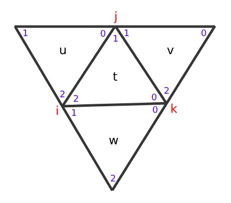

# Implementing Blended Piecewise Mobius Maps

###### by Simon Labunsky, supervisor Prof. Miri Ben-Chen

### Introduction

The Möbius interpolator is a novel method for generating smooth maps on planar triangle meshes based on discrete input maps. It ensures continuity between triangles, low quasi-conformal distortion for discretely conformal maps, and smooth texture transfer even on coarse triangulations. The approach, with a closed-form expression, is locally applicable to any discrete map, providing smooth results for extreme deformations. Its adaptability to surface and planar meshes, utilizing local intrinsic coordinates, makes it versatile. Comparative analysis demonstrates superior texture transfer and lower quasi-conformal errors compared to existing methods.

The goal of this project is to implement the algorithm.

### The Algorithm

**Input**: a 3d model (triangularized) + texture map represented by *.obj* file, subdivision factor (integer)

**Output**: a subdivided 3d model with the texture remapped to conform to the Blended Piecewise Mobius Maps interpolation.

for every face and his (potential) 3 neighbors:

* Rotate each neighbor to be aligned in the same plane as the target (t) face. consider each face to be in a 2d plane.
* Find mobius transform between the triangle face and the triangle face in the texture map for each face while every vertex in the 2d plane is represented by a complex point in the complex plane.

$$
M_{t},\ M_{u},\ M_{v},\ M_{w}
$$

    👉 the calculation can be found here:[wiki](https://en.wikipedia.org/wiki/M%C3%B6bius_transformation)

* Subdivide the target (t) face by subdivision factor
* Find the LogRatioInterpolator:

z is a vertex inside the target (t) face.

Rdistance:

$$
r_{ij}\left(z\right)=\text{distance}\left(z,\ edge_{ij}\right)
$$

Rdistance total:

$$
s\left(z\right)=r_{jk}\left(z\right)r_{ki}\left(z\right)+r_{ij}\left(z\right)r_{jk}\left(z\right)+r_{ij}\left(z\right)r_{ki}\left(z\right)
$$

Gamma:

$$
\gamma_{ij}\left(z\right)=\frac{r_{jk}\left(z\right)r_{ki}\left(z\right)}{s\left(z\right)}, \gamma_{jk}\left(z\right)=\frac{r_{ij}\left(z\right)r_{ki}\left(z\right)}{s\left(z\right)}, \gamma_{ki}\left(z\right)=\frac{r_{ij}\left(z\right)r_{jk}\left(z\right)}{s\left(z\right)}
$$

LogMobiusRatio:

$$
l_{tu}=\log\left(\text{sign}\left(\text{trace}\left(\text{Real}\left(\delta_{tu}\right)\right)\right)\cdot\delta_{tu}\right)
$$

$$
\delta_{tu}=M_{t}M_{u}^{-1}
$$

LogRatioInterpolator:

$$
l_{t}=\gamma_{ij}l_{ut}+\gamma_{jk}l_{vt}+\gamma_{ki}l_{wt}
$$

The final interpolator:

$$
O=\exp\left(\frac{1}{2}l_{t}\right)M_{t}
$$

* Apply the interpolator to the new subdivided vertices thus creating a new texture map with the custom interpolation.
* The result is a new, subdivided 3d model (obj) with the interpolated texture map.

### Development process

The initial idea was to implement a glsl shader to calculate the algorithm in real time. but after difficulties the subdivided model method was propesed.

#### Challenges

* Faces that had no 3 neighbors requires a special treatment:
  * the missing neighbor receive the middle (t) transformation. resulting in the log to be 0 and the exponent a complex identity matrix so the interpolator is the mobius transformation of the middle triangle.

#### Future Work

* an actual implementation of the shader so the algorithm can be applied on any model without subdividing it. the calculations might be a severe overhead on the gpu.
* using multiprocesses to speed up the calculation
* a adaptive algorithm that divides the polygons based on their size, more divisions for bigger polygons
